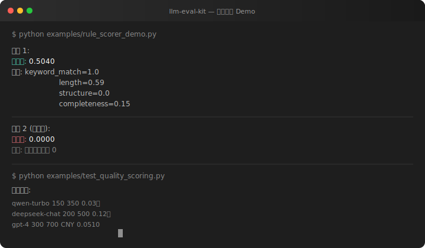
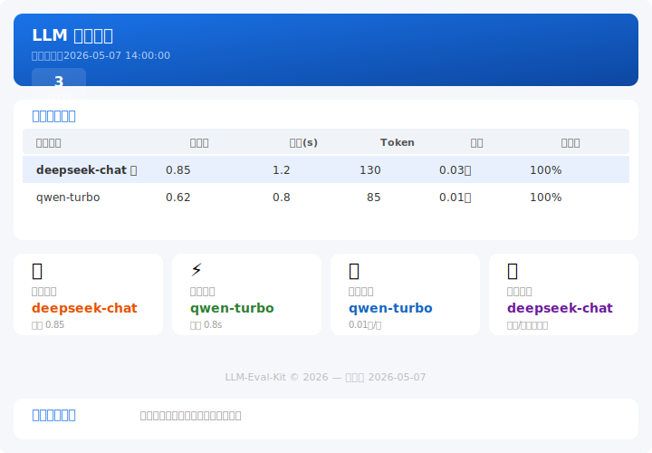

<p align="center">
  
</p>

<h1 align="center">llm-eval-kit</h1>

<p align="center">
  <b>中文轻量业务 LLM 评测工具箱</b><br>
  量化模型效果 · Prompt 改动 · 成本耗时<br>
  <i>不靠感觉靠数据</i>
</p>

<p align="center">
  
  
  
  
</p>

---

## 为什么需要它

做大模型应用时，你是不是经常遇到这些问题？

- **换了模型**，效果变好还是变差？凭感觉还是看数据？
- **改了 Prompt**，怎么证明这次迭代有价值？
- **几个模型同时备选**，哪个性价比最高？

llm-eval-kit 用代码 + 数据回答这些问题，**不靠感觉、不靠人工抽测、三板斧出结论**。

---

## 效果预览

### 终端对比报告

```
$ python examples/rule_scorer_demo.py

用例 1 (完整回答):
  综合分: 0.7900
  详情: keyword_match=1.0  length=1.0  structure=1.0  completeness=0.3

用例 2 (短回答):
  综合分: 0.0000
  详情: 全部维度均为 0

成本计算:
  qwen-turbo     150  350    0.03分
  deepseek-chat  200  500    0.12分
  gpt-4          300  700  CNY 0.0510
```

### HTML 可视化报告

<p align="center">
  
</p>

完整 HTML 报告见 [docs/images/](docs/images/)（支持交互查看每个样本的详细回答）。

---

## 安装

```bash
git clone https://github.com/xiaoKK903/LLM-Eval-Kit
cd LLM-Eval-Kit
pip install -e .
```

**只有 2 个依赖**：`httpx`（HTTP 请求）+ `jieba`（中文分词），不装 torch、不装 transformers、不装任何重型框架。

---

## 快速开始

### 命令行一键评测

```bash
llm-eval-kit eval \
  --model deepseek-chat \
  --api-key sk-xxx \
  --data data.jsonl \
  --base-url https://api.deepseek.com/v1
```

输出自动包含：**综合评分、响应延迟、Token 消耗、成本（CNY）**，以及最优模型推荐。

### Python API（三行代码）

```python
import asyncio
from llm_eval_kit import Evaluator

evaluator = Evaluator()
result = asyncio.run(evaluator.run(
    models=[{"model": "deepseek-chat", "api_key": "sk-xxx",
             "base_url": "https://api.deepseek.com/v1"}],
    data_path="data.jsonl",
))
```

### 更多示例

| 场景 | 文件 | 说明 |
|------|------|------|
| 规则评分 | [examples/rule_scorer_demo.py](examples/rule_scorer_demo.py) | 纯本地运行，无需 API Key |
| 单模型评测 | [examples/basic_usage.py](examples/basic_usage.py) | 最小化评测流程 |
| 多模型对比 | [examples/multi_model_compare.py](examples/multi_model_compare.py) | 多模型同数据对比 |

---

## 数据格式

JSONL，每行一个样本：

```jsonl
{"id": "1", "question": "退款多久到账？", "reference": "3-5个工作日", "expected_keywords": ["退款", "到账"]}
{"id": "2", "question": "怎么改密码？", "reference": "在设置页面修改", "expected_keywords": ["设置", "修改"]}
{"id": "3", "question": "订单未发货怎么办？", "reference": "联系客服查询并发货", "expected_keywords": ["客服", "发货"]}
```

- `id` / `question` — 必填
- `reference` — 参考答案（评分对比用）
- `expected_keywords` — 关键词列表（规则评分用）

---

## 评分引擎

### 规则评分（毫秒级，零外部依赖）

| 维度 | 说明 | 权重 |
|------|------|------|
| 关键词匹配 | 期望关键词的命中比例 | 40% |
| 长度合理性 | 回答长度与参考答案的匹配度 | 20% |
| 结构质量 | 是否包含 Markdown 标题、列表、表格等 | 20% |
| 完整度 | 中文业务完整性指标（总结/建议/步骤等） | 20% |

内置示例：
```python
from llm_eval_kit import RuleScorer

scorer = RuleScorer()
result = await scorer.score("问题", "回答内容", "参考答案")
print(result.total_score, result.details)
```

### LLM Judge（自动消除位置偏差）

用模型评模型，从 **准确性、完整性、简洁性** 三个维度打分。

**核心策略**：正反序双评取平均
- 第一轮：参考答案在前，模型回答在后
- 第二轮：模型回答在前，参考答案在后
- 最终分数 = 两轮平均，消除位置偏差

```python
from llm_eval_kit import LLMJudgeScorer

judge = LLMJudgeScorer(adapter=your_adapter)
result = await judge.score("问题", "模型回答", "参考答案")
```

---

## 项目结构

```
llm_eval_kit/
├── adapters/          # 模型适配（OpenAI 兼容接口）
│   ├── base.py        #   抽象基类
│   └── openai_compat.py  # 统一适配器（httpx，无 openai SDK）
├── scorers/           # 评分引擎
│   ├── base.py        #   评分基类
│   ├── rule_scorer.py #   规则评分（4 维）
│   └── llm_judge.py   #   LLM Judge（位置偏差消除）
├── dataset/           # 数据集加载
│   └── loader.py
├── reporter/          # 报表输出
│   ├── console_reporter.py  # 终端对比表
│   ├── comparator.py        # 模型对比逻辑
│   ├── html_reporter.py     # HTML 独立报告
│   └── models.py            # 数据模型
├── core/              # 核心调度
│   └── evaluator.py   #   Evaluator 主入口
├── utils/             # 工具函数
│   ├── cost_calc.py   #   成本计算（CNY + USD）
│   └── common.py
├── cli.py             # 命令行入口
└── __init__.py
```

**设计哲学**：轻量、模块化、不重复造轮子。不用 Flask/FastAPI/Jinja2/torch/transformers，纯 Python + httpx + jieba。

---

## 已测试模型

| 厂商 | 模型 | 定价（输入/输出 ¥/百万token） |
|------|------|------|
| DeepSeek | deepseek-chat, deepseek-coder | ¥1 / ¥2 |
| 阿里云  | qwen-turbo, qwen-plus, qwen-max | ¥0.3~2 / ¥0.6~4 |
| OpenAI  | gpt-3.5-turbo, gpt-4, gpt-4-turbo | ¥1.5~30 / ¥2~60 |

**理论上支持所有 OpenAI 兼容接口的模型**，只需配置 `base_url` + `api_key`。

---

## 技术亮点

- **异步并发**：asyncio + Semaphore 双层限流，4 倍以上吞吐提升
- **智能重试**：指数退避 + jitter 随机抖动，120s 熔断保护
- **位置偏差消除**：LLM Judge 正反序双评取平均，业界标准方案
- **成本自动换算**：小于 ¥0.01 自动显示为"X.XX分"，避免 ¥0.0000 尴尬
- **零重型依赖**：不装 torch/transformers/flask，2 个轻量依赖

---

## License

MIT
