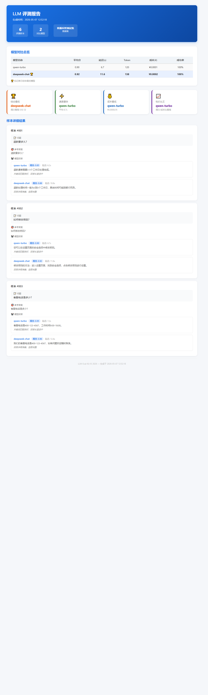

# LLM-Eval-Kit

> 轻量级大模型业务评测工具
> 帮你量化：换模型 / 改 Prompt 之后，效果变好了还是变差了

<p align="center">
  
</p>

---

## 快速开始

```bash
git clone https://github.com/your-username/llm-eval-kit.git
cd llm-eval-kit
pip install -e .
```

三行代码运行对比评测：

```python
from llm_eval_kit.reporter.console import ConsoleReporter
from llm_eval_kit.reporter.html_reporter import HtmlReporter

reporter = ConsoleReporter()
reporter.print_comparison_report(results)          # 控制台对比报告

HtmlReporter().generate_report(results)             # HTML 报告导出
```

完整可运行示例见 [`examples/compare_models.py`](examples/compare_models.py)。

---

## 解决什么问题

**1. 换了模型，怎么知道效果变没变？**

把旧模型和新模型跑在同一份测试数据上，对比评分、延迟、成本。

**2. 改了 Prompt，有没有变好？**

用规则评分 / LLM Judge 量化评分，不再凭感觉判断。

**3. 哪个模型更便宜又够用？**

自动计算每次调用的成本，给出性价比排名。

---

## 支持的模型

只适配了 **OpenAI 兼容接口**，不吹牛支持了谁。

| 已实测 | 模型 |
|--------|------|
| 千问 | qwen-turbo, qwen-plus, qwen-max（DashScope 兼容接口） |
| DeepSeek | deepseek-chat, deepseek-coder |
| OpenAI | gpt-3.5-turbo, gpt-4, gpt-4-turbo |

只要提供 OpenAI 兼容 HTTP API，换 `base_url` 和 `api_key` 就能用。
其他原生协议（Zhipu / ERNIE / Spark）暂未适配。

---

## 功能

| 功能 | 说明 |
|------|------|
| ⚡ 并发评测 | 异步并发调用，批量评测不排队 |
| 🎯 规则评分 | 关键词命中率 + 长度合理性 |
| 🤖 LLM Judge | 用大模型给大模型打分 |
| 📊 多模型对比 | 评分、延迟、Token、成本一目了然 |
| 📈 HTML 报告 | 带表格 + 结论卡片 + 样本详情的独立 HTML |
| 💰 成本计算 | 按 token 计价，支持自定义定价 |

---

## 项目结构

```
llm_eval_kit/
├── adapters/               # 模型适配器（OpenAI 兼容）
├── dataset/                # 数据集加载
├── scorers/                # 评分引擎（规则 / LLM Judge）
├── reporter/               # 报告生成（控制台 / HTML / 对比器）
├── metrics/                # 质量评分
└── client.py               # 主客户端
```

---

## 示例

```bash
# 多模型对比演示（无 API Key 时自动使用模拟数据）
python examples/compare_models.py

# 生成 HTML 报告
python examples/generate_report.py
```

---

## License

MIT

---

# LLM-Eval-Kit

> Lightweight LLM evaluation toolkit for engineering teams.
> Quantify the impact of model changes and prompt iterations.

<p align="center">
  
</p>

---

## Quick Start

```bash
git clone https://github.com/your-username/llm-eval-kit.git
cd llm-eval-kit
pip install -e .
```

```python
from llm_eval_kit.reporter.console import ConsoleReporter
from llm_eval_kit.reporter.html_reporter import HtmlReporter

reporter = ConsoleReporter()
reporter.print_comparison_report(results)

HtmlReporter().generate_report(results)
```

---

## Why

- Switched models but unsure if quality improved?
- Edited prompts but can't tell if it's better?
- Want to find the cheapest model that meets your needs?

---

## Supported Models

Only **OpenAI-compatible APIs** are supported.

| Tested | Models |
|--------|--------|
| Qwen | qwen-turbo, qwen-plus, qwen-max |
| DeepSeek | deepseek-chat, deepseek-coder |
| OpenAI | gpt-3.5-turbo, gpt-4, gpt-4-turbo |

Bring your own `base_url` and `api_key` for any OpenAI-compatible API.

---

## Features

- Async concurrent evaluation
- Rule-based scoring + LLM Judge
- Multi-model comparison reports
- HTML report export with conclusion cards
- Token-based cost calculation

---

## Examples

```bash
python examples/compare_models.py
python examples/generate_report.py
```

---

## License

MIT
